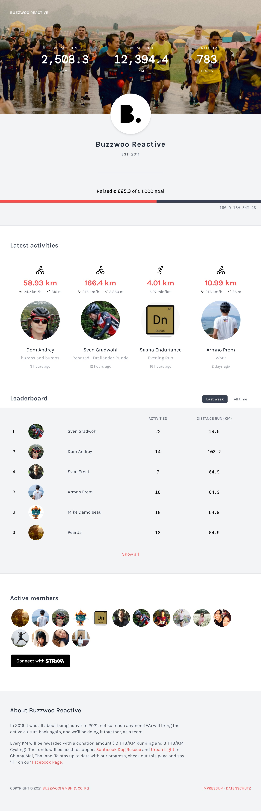

# tailwindcss-101

Learning TailwindCSS by recreating a static version of the original Buzzwoo Active landing page.



### Setup

```sh
$ npm install
$ npm run dev
```

### Build

```sh
$ npm run build
```
